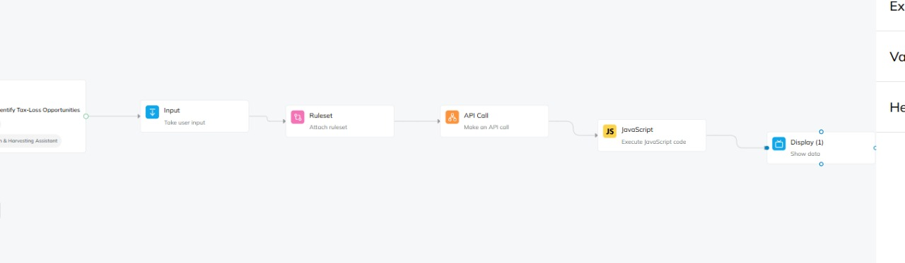
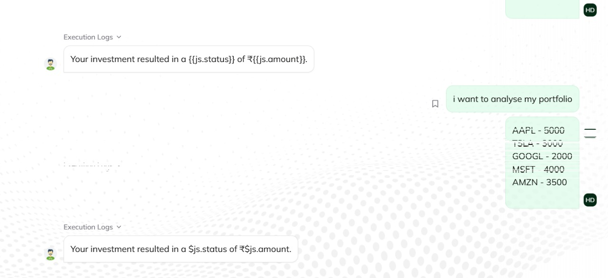
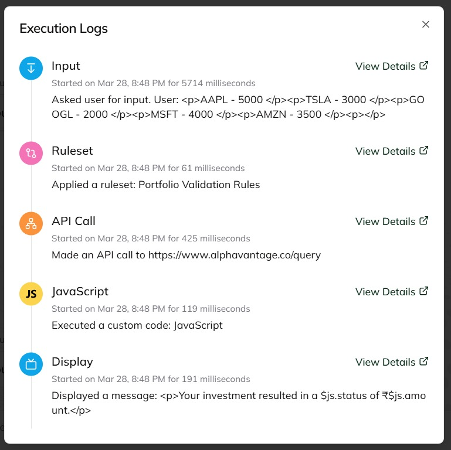
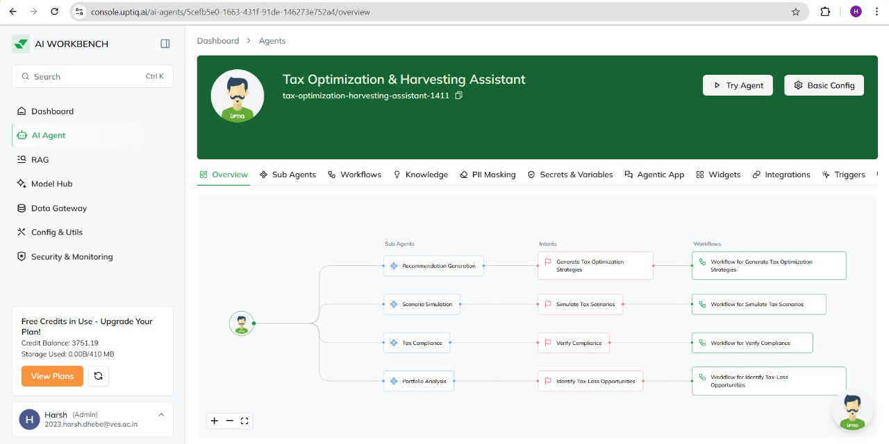
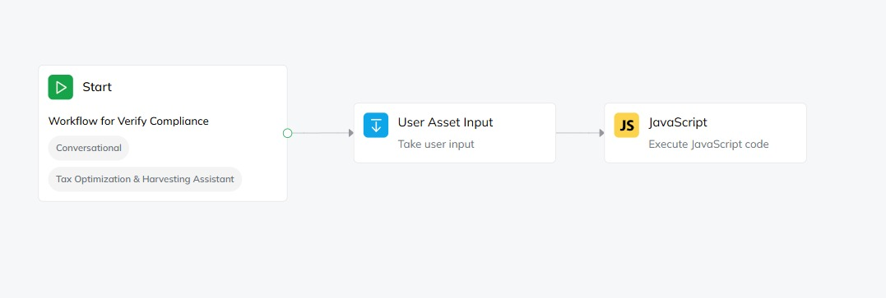

# Portfolio Analysis Subagent

## Overview
The **Portfolio Analysis Subagent** plays a crucial role in analyzing an investor's portfolio to identify tax loss harvesting opportunities. It processes data through several key stages, ensuring that investment strategies align with financial objectives and tax optimization practices.

## Workflow of Portfolio Analysis Subagent
1. **Data Ingestion:** Collects financial data through an input node.
2. **Data Validation:** Ensures data accuracy and consistency using predefined rules.
3. **Market Data Fetching:** Retrieves the latest financial data to assess market conditions.
4. **Portfolio Analysis:** Evaluates the investor’s holdings to detect potential losses.
5. **Tax Loss Report:** Provides a comprehensive report on tax loss harvesting based on the analysis.

## 🖼️ Images
Below are images illustrating the workflow of the Portfolio Analysis Subagent and its integration with other components:

### 🔹 Portfolio Analysis Workflow  
  

### 🔹 Portfolio Analysis Details  
  

### 🔹 Portfolio Analysis Report  
  

### 🔹 Portfolio Analysis Insights  
  

### 🔹 Portfolio Analysis Summary  
  

## Other Subagents

### 1. Tax Compliance Subagent
- Receives a list of suggested asset sales from the portfolio analysis.
- Connects to tax databases or APIs to retrieve updated tax regulations.
- Assesses transactions against tax laws and identifies potential violations.
- Generates a compliance report indicating permissible transactions and required modifications.

### 2. Scenario Simulation Subagent
- Collects portfolio data and proposed transactions.
- Defines multiple scenarios considering market conditions, holding periods, and reinvestment strategies.
- Runs simulations to determine potential tax impacts and financial outcomes.
- Produces a comparative analysis to evaluate the benefits and risks of different strategies.

### 3. Recommendation Subagent
- Integrates insights from Portfolio Analysis, Tax Compliance, and Scenario Simulation.
- Synthesizes data to develop personalized tax optimization recommendations.
- Ensures that recommended strategies comply with tax laws.
- Provides clear, actionable steps for investors to implement suggested strategies.

## Conclusion
The **Portfolio Analysis Subagent** is a fundamental component in financial planning, ensuring that investments are optimized for tax efficiency. Together with the Tax Compliance, Scenario Simulation, and Recommendation subagents, it forms a comprehensive system for intelligent tax optimization and financial strategy development.
