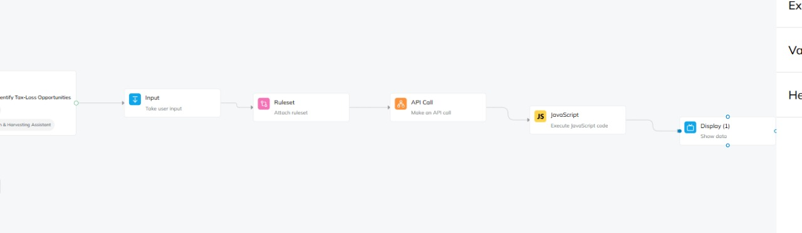
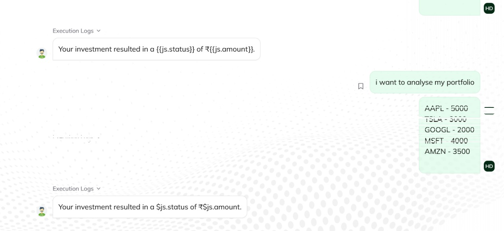
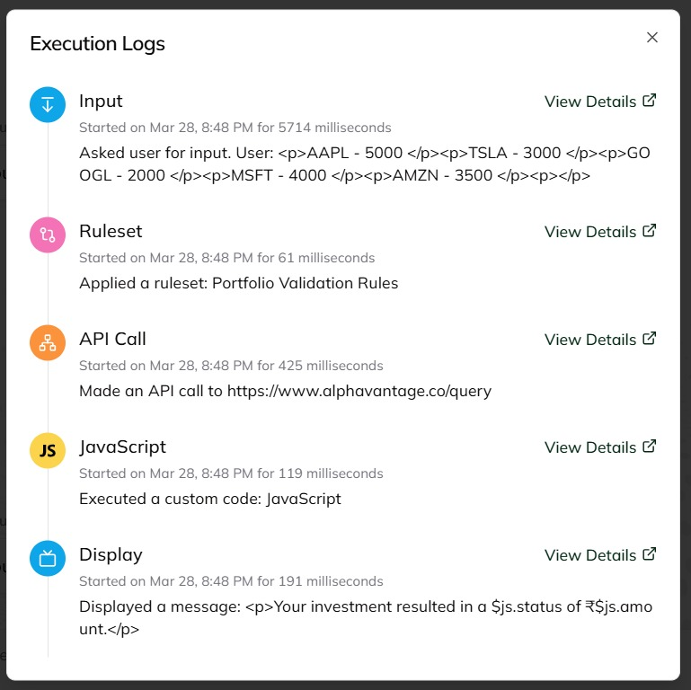
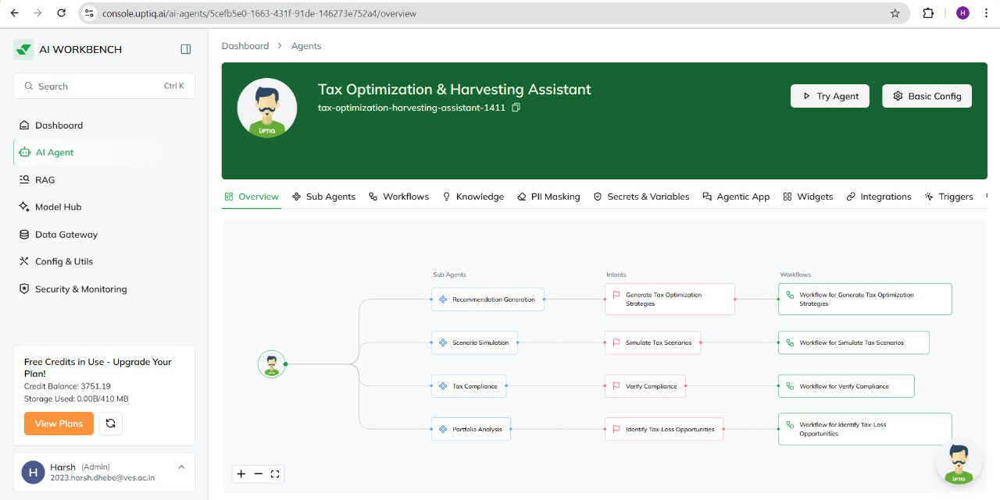
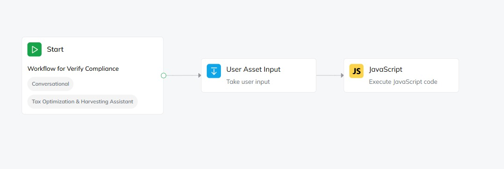
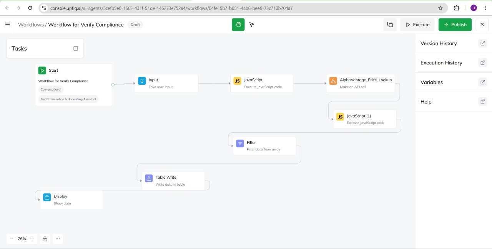
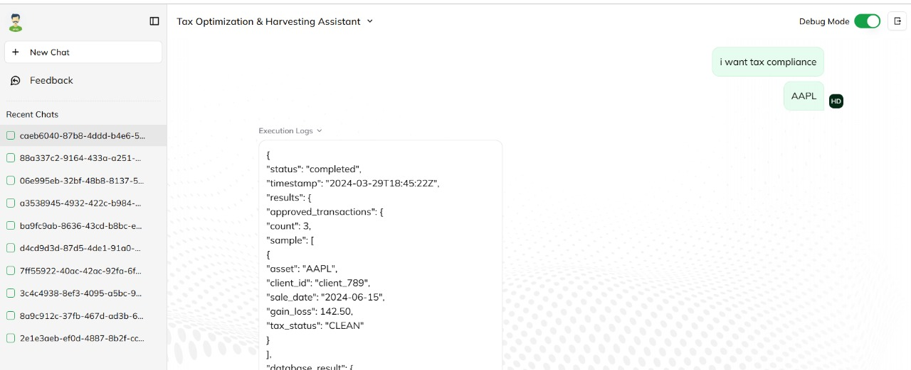
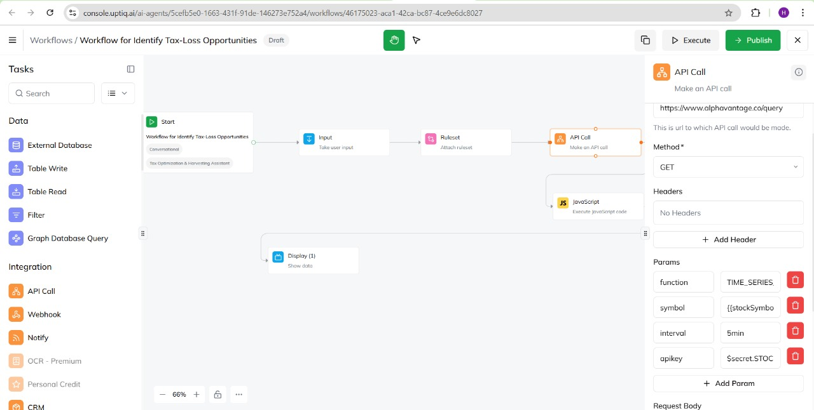
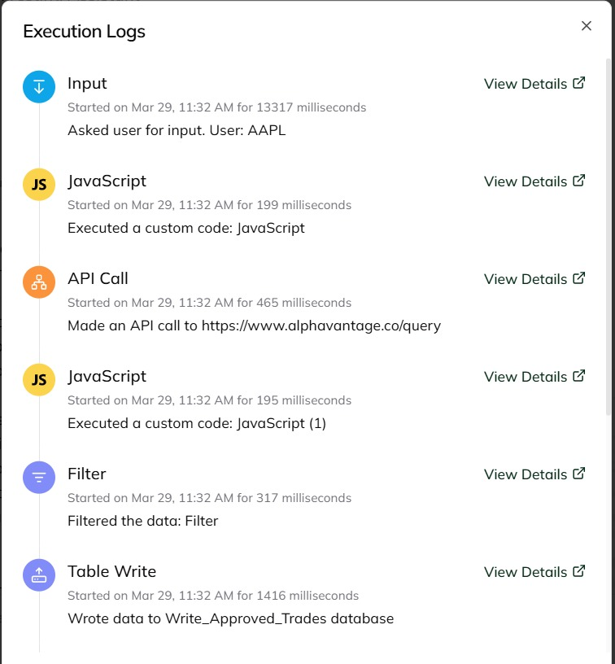

# Portfolio Analysis Subagent  

## Overview  
The **Portfolio Analysis Subagent** plays a crucial role in analyzing an investor's portfolio to identify tax loss harvesting opportunities. It processes data through several key stages, ensuring that investment strategies align with financial objectives and tax optimization practices.  

## Workflow of Portfolio Analysis Subagent  
1. **Data Ingestion:** Collects financial data through an input node.  
2. **Data Validation:** Ensures data accuracy and consistency using predefined rules.  
3. **Market Data Fetching:** Retrieves the latest financial data to assess market conditions.  
4. **Portfolio Analysis:** Evaluates the investor’s holdings to detect potential losses.  
5. **Tax Loss Report:** Provides a comprehensive report on tax loss harvesting based on the analysis.  

## 🖼️ Images  

### 🔹 Portfolio Analysis Workflow  
  

### 🔹 Portfolio Analysis Details  
  

### 🔹 Portfolio Analysis Report  
  

### 🔹 Portfolio Analysis Insights  
  

### 🔹 Portfolio Analysis Summary  
  

---

# Scenario Simulation Subagent  

## Overview  
The **Scenario Simulation Subagent** is designed to help investors analyze different financial strategies by simulating various market conditions and investment scenarios. This allows for informed decision-making and optimized tax strategies.  

## Workflow of Scenario Simulation Subagent  
1. **Portfolio Data Collection:** Gathers information on current holdings and proposed transactions.  
2. **Scenario Definition:** Defines multiple investment scenarios considering:  
   - Market fluctuations  
   - Holding periods  
   - Reinvestment strategies  
3. **Simulation Execution:** Runs simulations to analyze tax impacts and financial performance.  
4. **Comparative Analysis:** Evaluates different strategies to assess benefits and risks.  
5. **Final Report:** Generates insights and recommendations based on simulation results.  

## 🖼️ Images  

### 🔹 Scenario Simulation Workflow  
  

### 🔹 Scenario Analysis Overview  
  

### 🔹 Simulation Results  
  

### 🔹 Optimized Investment Strategy  
  

---

# Other Subagents  

### 1. Tax Compliance Subagent  
- Receives a list of suggested asset sales from the portfolio analysis.  
- Connects to tax databases or APIs to retrieve updated tax regulations.  
- Assesses transactions against tax laws and identifies potential violations.  
- Generates a compliance report indicating permissible transactions and required modifications.  

### 2. Recommendation Subagent  
- Integrates insights from Portfolio Analysis, Tax Compliance, and Scenario Simulation.  
- Synthesizes data to develop personalized tax optimization recommendations.  
- Ensures that recommended strategies comply with tax laws.  
- Provides clear, actionable steps for investors to implement suggested strategies.  

---

# Conclusion  
The **Portfolio Analysis Subagent** is a fundamental component in financial planning, ensuring that investments are optimized for tax efficiency. The **Scenario Simulation Subagent** further enhances decision-making by predicting the potential impact of various investment strategies. Together with the **Tax Compliance** and **Recommendation Subagents**, this system creates a comprehensive framework for intelligent tax optimization and financial strategy development.  
